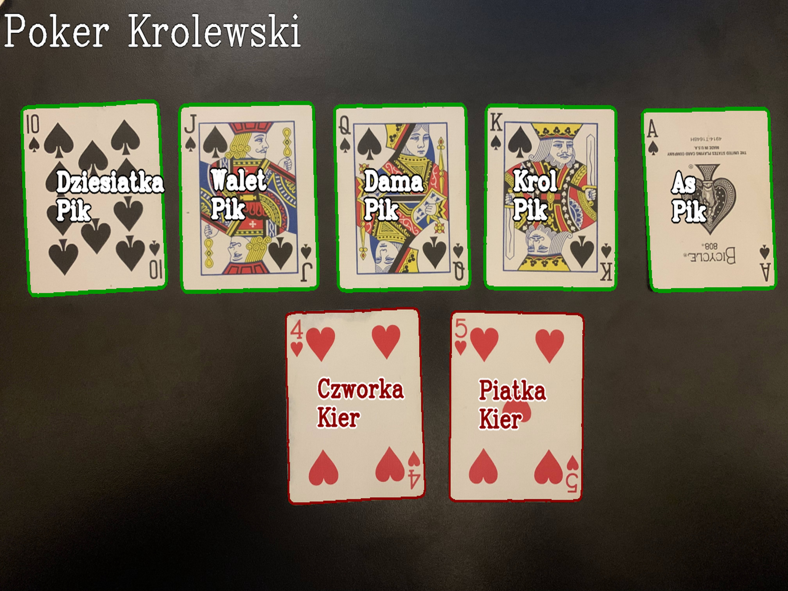

<h1 align="center">
    Poker Recognizer ♠️
</h1>

_Dostępne również w wersji po: [English](README.md)_

## O projekcie

Poker Recognizer - projekt w ramach przedmiotu Komunikacja Człowiek Komputer na Politechnice Poznańskiej.



Celem projektu było zaimplementowanie algorytmu rozpoznającego ze zdjęcia karty do gry w pokera z wykorzystaniem [pythona](https://www.python.org/) i biblioteki [OpenCV](https://opencv.org/). Dodatkowo zaimplementowany został algorytm znajdujący najlepszą możliwą pokerową kombinacje pięciu z siedmiu przedstawionych na zdjęciu kart. Rezultat końcowy w postaci pierwotnie wgranego przez użytkownika zdjęcia z nałożonymi na niego odpowiednimi podpisami rozpoznanych kart oraz opis działania całego algorytmu na podstawie wgranego przykładu, przedstawiony został na dodatkowo stworzonej przy pomocy biblioteki [React](https://reactjs.org/) stronie internetowej.

## Uruchamianie

W celu uruchomienia programu lokalnie, wymagany jest menadżer pakietów [yarn](https://yarnpkg.com/) oraz [pip](https://pypi.org/project/pip/). W folderze z projektami:

1. Klonowanie repozytorium
   ```sh
   git clone https://github.com/filipciesielski7/Poker_Recognizer.git
   ```
2. Przejście do folderu Poker_Recognizer
   ```
   cd Poker_Recognizer
   ```
3. Instalacja wymaganych zależności, uruchamiając poniższe komendy:
   ```
   pip install -r requirements.txt
   yarn install
   ```
4. Uruchomienie strony internetowej oraz serwera aplikacji:
   ```
   yarn start
   yarn start-api
   ```

Następnie aby zobaczyć stronę, należy udać się pod adres: http://localhost:3000/
